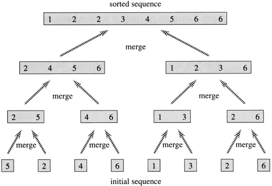

## 算法原理 ##
归并排序（Merge Sort，台湾译作：合并排序）是建立在归并操作上的一种有效的排序算法。该算法是采用[分治法](http://zh.wikipedia.org/wiki/%E5%88%86%E6%B2%BB%E6%B3%95)（Divide and Conquer）的一个非常典型的应用。

归并操作(Merge)，也叫归并算法，指的是将两个已经排序的序列合并成一个序列的操作。归并排序算法依赖归并操作。归并排序有多路归并排序、两路归并排序 , 可用于内排序，也可以用于外排序。这里仅对内排序的两路归并方法进行讨论。 

算法思路：
1. 把 n 个记录看成 n 个长度为 l 的有序子表
2. 进行两两归并使记录关键字有序，得到 n/2 个长度为 2 的有序子表
3. 重复第 2 步直到所有记录归并成一个长度为 n 的有序表为止。


<!--more-->

## 实例分析 ##

以数组 array = [6, 5, 3, 1, 8, 7, 2, 4] 为例，首先将数组分为长度为 2 的子数组，并使每个子数组有序：

``` javascript
   [6, 5]  [3, 1]  [8, 7]  [2, 4]
      ↓       ↓       ↓       ↓
   [5, 6]  [1, 3]  [7, 8]  [2, 4]
```

然后再两两合并：

``` javascript
   [6, 5, 3, 1]  [8, 7, 2, 4]
         ↓             ↓
   [1, 3, 5, 6]  [2, 4, 7, 8]
```

最后将两个子数组合并：

``` javascript
   [6, 5, 3, 1, 8, 7, 2, 4]
               ↓
   [1, 2, 3, 4, 5, 6, 7, 8]
```

排序过程动画演示如下：


再有数组 array = [5, 2, 4, 6, 1, 3, 2, 6]，归并排序流程也可以如下表示：



## CPP 语言实现 ##
屌丝的惯例，上代码，由于要两两归并的子数组都是有序的数组，同时我们在希尔排序中提到过“插入排序在对几乎已经排好序的数据操作时， 效率高， 即可以达到线性排序的效率”，所以我们可以将其中一个子数组中的元素依次插入到另一个数组当中，使其归并后成为一个有序的数组。代码如下：

``` cpp
typedef int elem_t;


/**
 * @brief 对array数组的left到right部分进行排序
 * @param[in] array 欲排序的数组
 * @param[in] left, right 数组的下标
 * @return 无
 */
void
sort(elem_t array[], int left, int right)
{
	if (right <= left) return; /* 递归终止条件 */
	int mid = (left + right) / 2;

	sort(array, left, mid); /* 分治法 */
	sort(array, mid + 1, right);

	/* array[left, mid]以及array[mid+1, right]都已经有序 */
	int l = left, h = mid + 1;
	while (l < h && h <= right) {
		/* l指向array[left, mid]这一边, h指向array[mid+1, right]这一边,
		 * 开始合并两个数组.这里的主题思想是,让array[left, mid]中较大的部分
		 * 迁移到右侧.
		 */
		if (array[l] > array[h]) {
			elem_t tmp = array[h];
			for (int i = h - 1; i >= l; i--) {
				array[i + 1] = array[i]; 
			}
			array[l] = tmp;
			h++;
		}
		/* 不管交换与否,l总要向前移动 */
		l++;
    }
}


/**
 * @brief 归并排序
 * @param[in] array 欲排序的数组
 * @param[in] len 数组的大小
 * @return 无
 */
void
merge_sort(elem_t array[], int len)
{
	sort(array, 0, len - 1);
}
```

## 稳定性分析 ##

归并排序是一个 **稳定** 的排序算法.

我们只需要看归并的过程就可以了:

```cpp
    /* array[left, mid]以及array[mid+1, right]都已经有序 */
	int l = left, h = mid + 1;
	while (l < h && h <= right) {
		/* l指向array[left, mid]这一边, h指向array[mid+1, right]这一边,
		 * 开始合并两个数组.这里的主题思想是,让array[left, mid]中较大的部分
		 * 迁移到右侧.
		 */
		if (array[l] > array[h]) {
			elem_t tmp = array[h];
			for (int i = h - 1; i >= l; i--) {
				array[i + 1] = array[i]; 
			}
			array[l] = tmp;
			h++;
		}
		/* 不管交换与否,l总要向前移动 */
		l++;
    }
```

只有当 `l` 下标对应的元素等于 `h` 下标对应的元素, 只执行 `l++` , 这意味着两个相等的值的相对位置没有发生改变. 当然,我们只要对代码做一点点修改, `array[l] >= array[h]`, 算法立马变得不稳定了.

## 参考文章 ##

- [Wikipedia](http://en.wikipedia.org/wiki/Merge_sort)
- [维基百科，自由的百科全书](http://zh.wikipedia.org/wiki/%E5%BD%92%E5%B9%B6%E6%8E%92%E5%BA%8F)
- [Merge Sort](http://www.personal.kent.edu/~rmuhamma/Algorithms/MyAlgorithms/Sorting/mergeSort.htm)
- [两路归并算法](http://student.zjzk.cn/course_ware/data_structure/web/paixu/paixu8.5.1.1.htm)
- [MERGE SORT 动画演示](http://www.ee.ryerson.ca/~courses/coe428/sorting/mergesort.html)